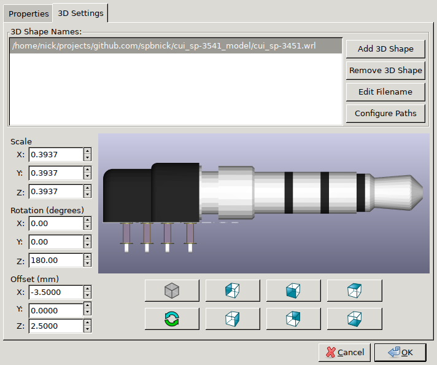

CUI SP-3541 3D model
====================

This is a 3D model of CUI SP-3541 through hole-mounted 3.5mm audio plug.
It's done based on the drawings from the datasheet with the missing dimensions
measured from the drawing or approximated. The STEP model lacks the colors,
and VRML model has them and uses millimeters as units.

See the below screenshot for transformation parameters needed to align the
model with the footprint provided by the manufacturer. Note that the
manufacturer's KiCAD footprint also needs through-holes and pad sizes and
geometry adjusted.

I'm putting this model in public domain, any use, modification, or
reproduction is permitted. The rights to the design of the plug itself belongs
to CUI.
